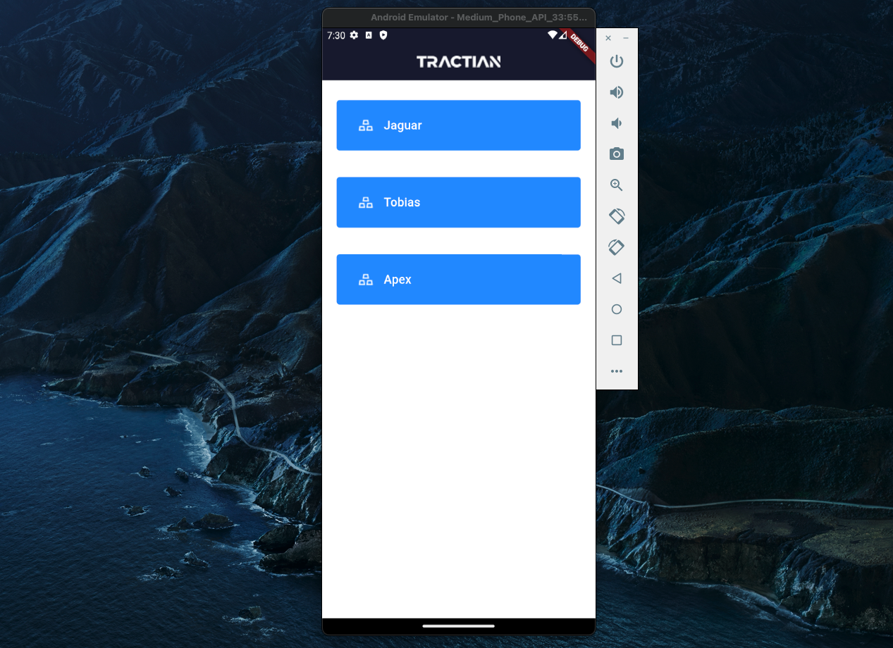

# Mobile Software Engineer

Assets are essential to the operation of the industry, it can include everything from manufacturing equipment to transportation vehicles to power generation systems. Proper management and maintenance is crucial to ensure that they continue to operate efficiently and effectively. A practical way to visualize the hierarchy of assets is through a tree structure.

## Preview

--- 
## 📦 Packages e Arquitetura
Os packages seguintes foram utilziados para a construção do projeto. Não foram para a construção da Árvore nem da UI. 
- dio
- get_it
- go_router
- font_awesome_flutter

Foi utilizada a arquitetura MVVM Clean, seguindo a estrutura de camadas data, domain e presentation. 

## 🛠️ Melhorias futuras
- Tratativa melhor dos erros em todas as partes das camadas
- Testes unitários e de integração
- Melhorar a filtragem (Por motivos de tempo a filtragem de LOCAIS não está 100% funcional).

